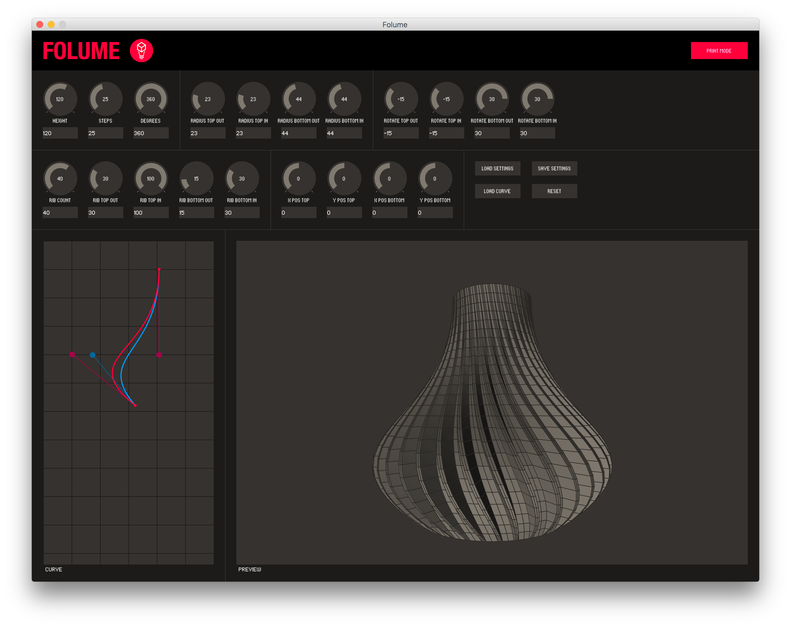
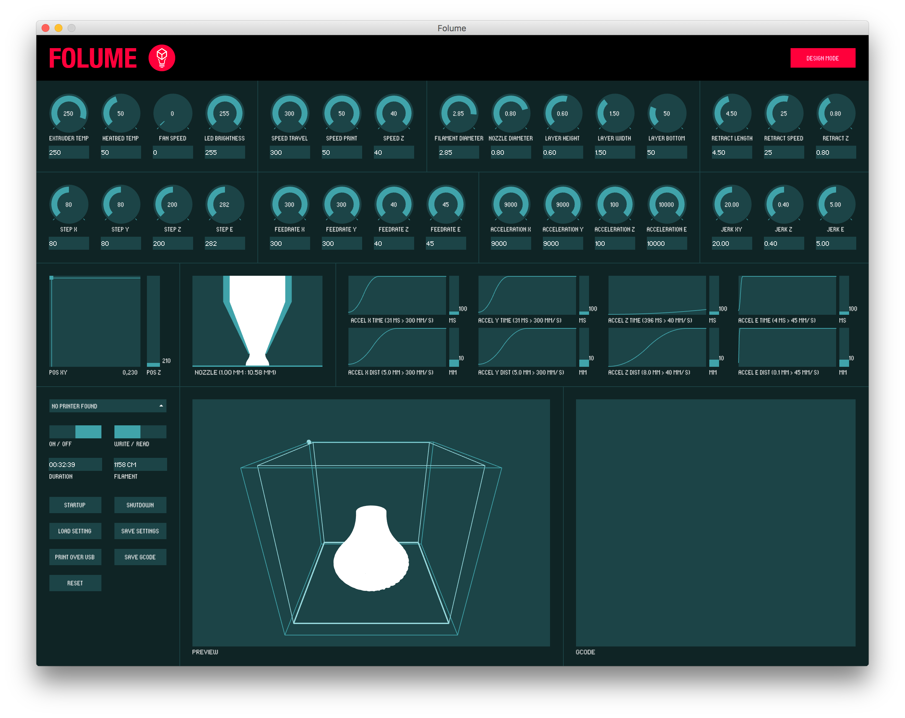

# Folume

Folume is a experimental design and printing tool for the Ultimaker 2.

A while ago I wanted to learn more about 3D printing and bought a [Ultimaker 2](https://ultimaker.com/en/products/ultimaker-2) 3D printer. Like most people I started my first steps in 3D printing by printing some free 3D models using tools like [Cura](https://ultimaker.com/en/products/cura-software) and [Simplify3D](https://www.simplify3d.com/). But in order to properly design a model from scratch, I would needed to learn additional design tools like [Maya](https://www.autodesk.com/products/maya/overview) or [Blender](https://www.blender.org/). 

Instead of learning a new design tool, I wanted to build something that allowed me to understand the details of 3D printing. Something that could make/generate a simple design and send that directly to the printer without any abstraction layer or interpretation. To keep things simple I decided to stick to a basic mathematical shape and lo and behold: The idea behind this *"cylindrical lamp shade design tool"* was born.

The first thing to know is that 3D printers don't understand 3D models, instead they need to be converted (sliced) to a format or 'language' called called [G-code](http://reprap.org/wiki/G-code). This G-code tells the printer __exactly__ what to do and when to do it. So I created an application in [Processing](https://processing.org) that can generate a design, output it as G-Code and send that to the printer via USB. Working with this G-Code directly allowed me to learn all the settings like temperature, acceleration, feed-rate, retraction, etc. 

**Results:**
1. We now have some nice [lamp shades](examples/print-light-off.png) for our home.
2. 3D printing is a very very slow process. Even printing a simple lamp shade would take around 30-45 minutes. This makes debugging your tool a bit of a pain in the ass. 

## Examples





[example.gcode](examples/example.gcode)

## Requirements
- [Java](http://www.oracle.com/technetwork/java/javase/downloads/index.html)
- [Processing 3](https://processing.org)
- [ControlP5](http://www.sojamo.de/libraries/controlP5/) (Install via Processing Contribution Manager)

## Build
```shell
./build.sh
```
JAR can be found in */build/artifacts/Folume.jar*